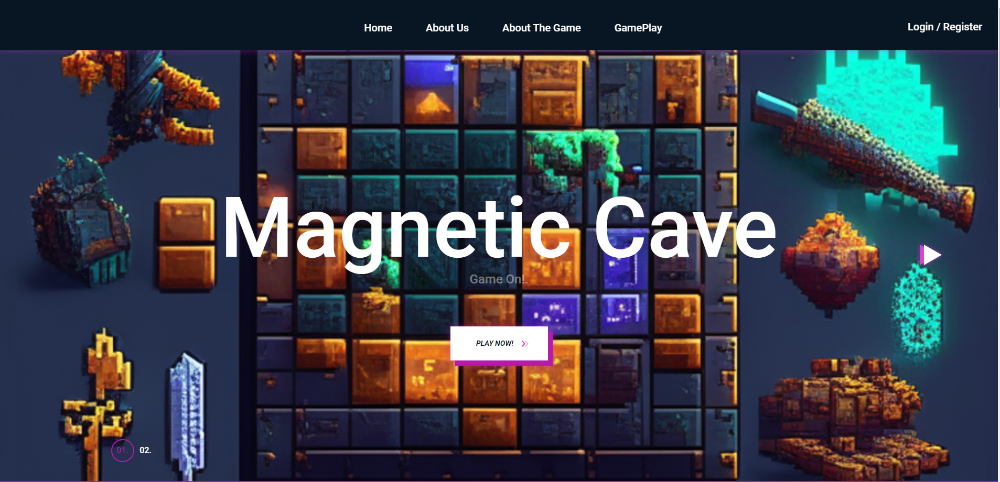
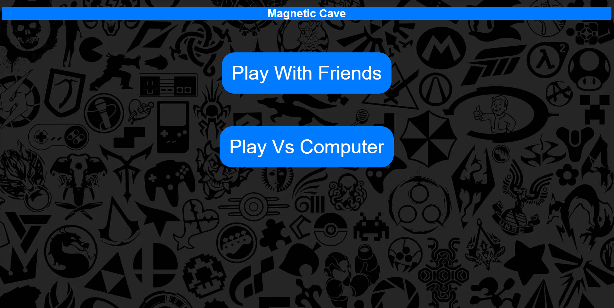
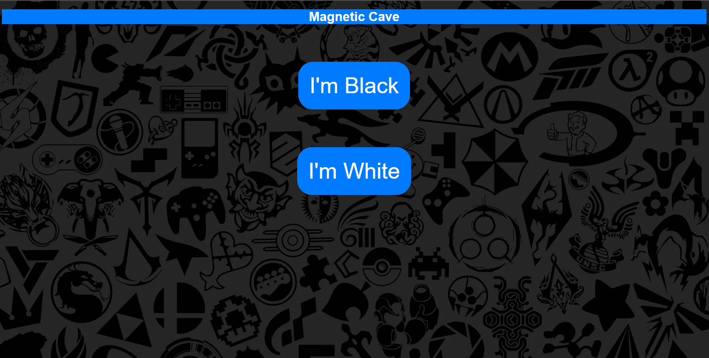
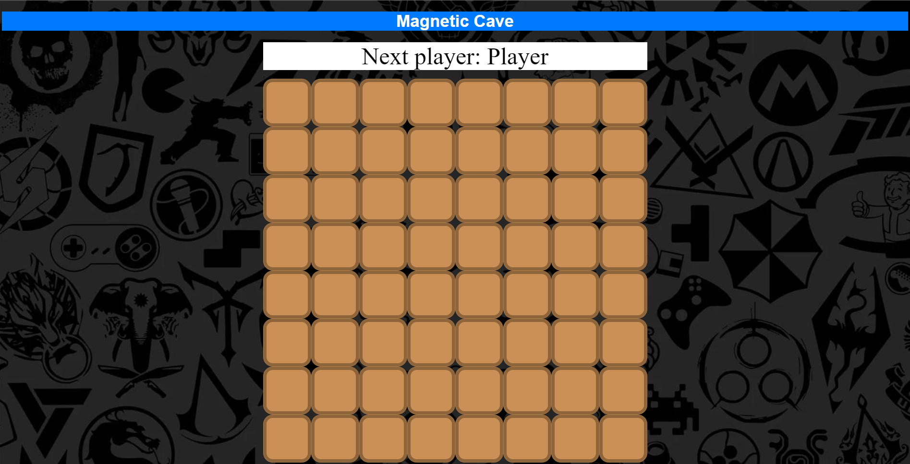
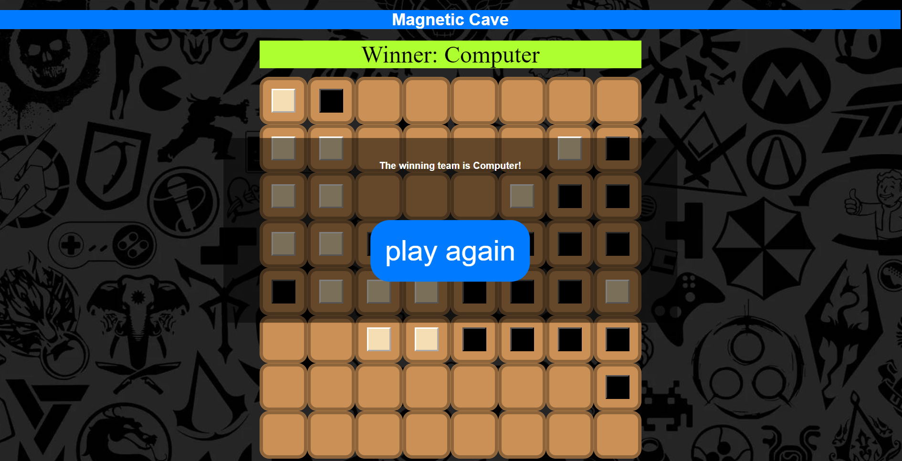

# Project 1
# Simple Website Game

A Simple two-player website game called Magnetic Cave, using Minmax Algorithm.

Magnetic Cave is a 2-player adversary game where each player tries to build a “bridge” of 5 magnetic bricks within a
cave whose left and right walls are magnetic. For the sake of this project, the bricks of one player will be represented
by a ■ and the bricks of the other by a □. The Magnetic Cave will be played on a regular 8x8 chess board

 ## Minmax Algorithm
 ### minimax(squares, depth, isMaximizing, player, opponent):
    This function implements the minimax algorithm to determine the best move for the computer
    player. It takes five parameters: squares (representing the current state of the game
    board), depth (representing the depth of the recursive minimax search),
    isMaximizing (indicating whether the current turn is for the maximizing player),
    player (representing the computer player's color), and opponent (representing the
    opponent's color). The function recursively explores the game tree by simulating
    all possible moves and assigns scores to each possible outcome. It alternates
    between maximizing and minimizing the score based on the player's turn. The
    function returns the best score achievable for the computer player
 
---

___________________________________________________________

🔗 | [Project Description](AI_project.pdf)   
🔗 | [Report](AIReport.pdf)   
🔗 | [Visit Website](https://lucent-lebkuchen-a93af8.netlify.app/)

 ## Partners
___________________________________________________________
🔗 | [Osaid Hamza](https://github.com/OsaidHamza7)  
🔗 | [Mohammad Odeh](https://github.com/M7mdOdeh1) 
___________________________________________________________
